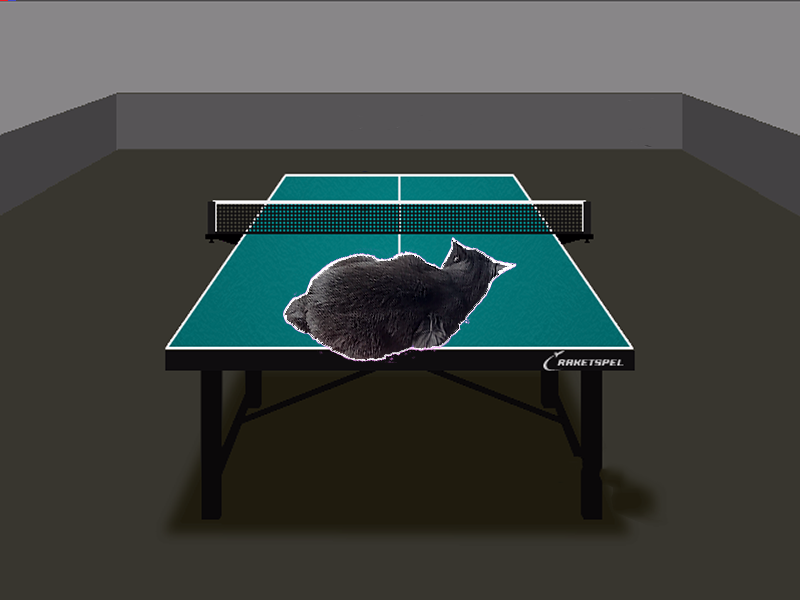
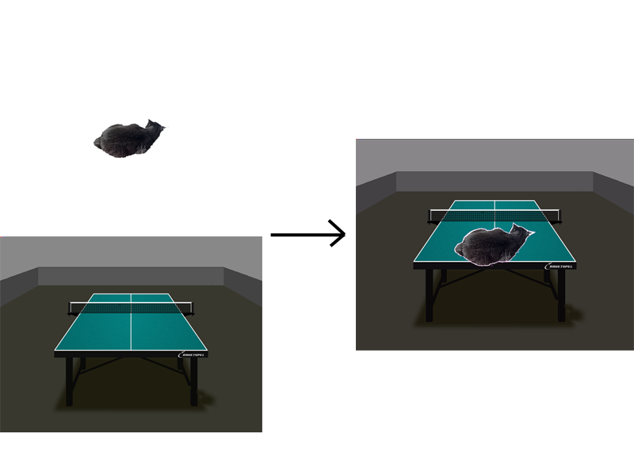
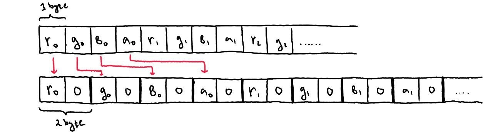
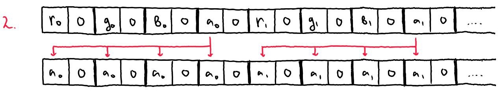
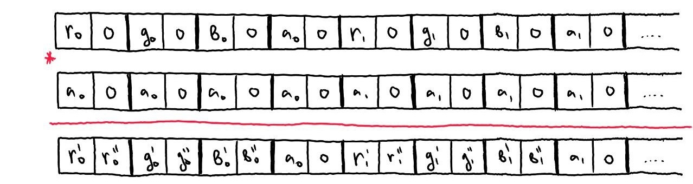
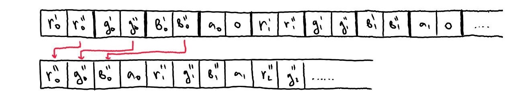

# Скриншоты



# Цель работы
Это продолжение работы (после Мандельброта) по оптимизации програм с использованием SIMD команд. В этой работе оптимизируется объединение (блендинг) изображений с учетом их прозрачности.

# Введение
Один из вариантов для блендинга изображений с прозрачностью с использованием такой формулы:

`color = color_front * alpha + color_back * (1 - alpha)`, где `alpha` - альфа-составляющая заднего фона, выраженная в значении от 0 до 1.

Чтобы не проводить вычисления в нецелых числах и приводить их к целым, будем считать с переполнением в значениях от 0 до 255. 

___

Идея для оптимизации с помощью SIMD такова:
1. *Расширение чисел*

     
   Так как умножение однобайтных чисел может в результате дать двухбайтное, мы **расширяем** наши однобайтные компоненты цвета (R, G, B, A) до двухбайтных чисел. На картинке не показано, но из-за такого удвоения длины чисел, мы будем рассматривать исходные данные по половинкам, в нашем случае по 256 бит (32 бита * 8 пикселей). 
2. *Перенос альфа-компонента*

    
    С помощью shuffle-устройства мы генерируем такую перестановку, чтобы поместить значение альфа-составляющей под остальными компонентами
3. *Перемножение*

    
    Перемножаем числа
4. *Упаковка чисел*

    
    Выделяем старшую часть числа, которая получилась при переполнении и выделяем её обратно в однобайтное число

На картинках показан общий принцип работы программы. Конкретная реализация приведена в коде, в ней используются команды для конвертации типов данных и битовых сдвигов.

# Ход работы
1. Была реализована базовая версия алгоритма
2. Код базовой версии был изменен с учётом дальнейшей идеи оптимизации. В дальнейшем эта версия обозначается *наивной*
4. Программа была оптимизирована с использование **AVX512**. Эта версия обозначается *оптимизированной*
5. Измерил производительность *оптимизированной* и *наивной* версии с учётом и без оптимизации компилятора
6. Воспользовался инструментом godbolt.org и рассмотрел ассемблерные инструкции, которые получаются на выходе компилятора
7. Сравнил набор команд, используемый компилятором в *наивной* и *оптимизированной* версиях
8. Сравнил оптимизацию интринсиков, используемых в *оптимизированной* версии
9. Проанализировал скорость работы и размер выходных инструкций

# Сравнение выхода компилятора

```
    uint32_t alpha = (front_color >> 0x18) & 0xFF;

    uint32_t a = (uint16_t)  ((back_color >> 0x18) & 0xFF);

    uint32_t r = ((uint16_t) ( front_color          & 0xFF) * alpha +
                  (uint16_t) (  back_color          & 0xFF) * (255 - alpha)) >> 8;

    uint32_t g = ((uint16_t) ((front_color >> 0x8 ) & 0xFF) * alpha +
                  (uint16_t) (( back_color >> 0x8 ) & 0xFF) * (255 - alpha)) >> 8;

    uint32_t b = ((uint16_t) ((front_color >> 0x10) & 0xFF) * alpha +
                  (uint16_t) (( back_color >> 0x10) & 0xFF) * (255 - alpha)) >> 8;

    uint32_t color = (a << 0x18) +
                     (b << 0x10) +
                     (g <<  0x8) + r;
```

## Наивная версия с `-O2`:
```
    mov     r13d,   ecx
    mov     eax,    esi
    movzx   ebx,    ch
    movzx   r10d,   sil
    shr     r13d,   24
    movzx   ebp,    ah
    vmovq   rax,    xmm0
    sub     r12d,   r13d
    imul    ebx,    r13d
    imul    ebp,    r12d
    imul    r10d,   r12d
    add     ebx,    ebp
    movzx   ebp,    cl
    shr     ecx,    16
    imul    ebp,    r13d
    xor     bl,     bl
    movzx   ecx,    cl
    imul    ecx,    r13d
    add     ebp,    r10d
    shr     ebp,    8
    add     ebx,    ebp
    mov     ebp,    esi
    shr     esi,    16
    movzx   esi,    sil
    and     ebp,    -16777216
    imul    esi,    r12d
    add     ebx,    ebp
    add     ecx,    esi
    shr     ecx,    8
    sal     ecx,    16
    add     ebx,    ecx
```
Даже с `-O2` в наивной реализации компилятор не в силах оптимизировать

## Оптимизировнная версия с `-O2`:
```
    vmovdqu32       zmm4, ZMMWORD PTR [r8+rax]
    vmovdqu         ymm3, YMMWORD PTR [r8+rax]
    vmovdqu32       zmm1, ZMMWORD PTR [r9+rax]
    vmovdqu         ymm0, YMMWORD PTR [r9+rax]
    vextracti32x8   ymm2, zmm4, 0x1
    vpmovzxbw       zmm3, ymm3
    vpmovzxbw       zmm2, ymm2
    vpshufb         zmm5, zmm3, zmm7
    vextracti32x8   ymm1, zmm1, 0x1
    vpshufb         zmm4, zmm2, zmm7
    vpmullw         zmm3, zmm3, zmm5
    vpsubusw        zmm9, zmm6, zmm5
    vpsubusw        zmm8, zmm6, zmm4
    vpmovzxbw       zmm0, ymm0
    vpmovzxbw       zmm1, ymm1
    vpmullw         zmm0, zmm0, zmm9
    vpmullw         zmm1, zmm1, zmm8
    vpmullw         zmm2, zmm2, zmm4
    vpaddw          zmm0, zmm0, zmm3
    vpaddw          zmm1, zmm1, zmm2
    vpsrlw          zmm0, zmm0, 8
    vpsrlw          zmm1, zmm1, 8
    vpmovwb         ymm0, zmm0
    vpmovwb         ymm1, zmm1
    vinserti64x4    zmm0, zmm0, ymm1, 0x1
    vmovdqu64       ZMMWORD PTR [rsi+rax], zmm0
```

# Результаты измерений
Аналогично задаче по построение множества Мандельброта, чтобы замерить именно производительность вычисления, я проводил вычисления картинки фиксированное количество раз, в моём случае 200, и с его учётом измерял количество кадров в секунду. Так я смог пренебречь затратами на отрисовку кадра по сравнению с её расчётом, искусственно сместив вес вычислений

| FPS              | `-O0`  | `-O2`   |
|------------------|--------|---------|
| Оптимизированная | 376.90 | 2645.42 |
| Наивная          | 255.70 | 501.33  |

Я привёл результаты замеров с флагами `-O0` и `-O2` для того, чтобы показать:
1. Компилятор пытается использовать **XMM** регистры для ускорения расчётов с плавающей точкой
2. Компилятор может оптимизировать код, написанный с использованием интринсиков, в отличие от кода с ассемблерными вставками

Таким образом, исходя из данных в таблице, я получил ускорение программы (сравнивая версии с оптимизациями компилятора) примерно в 12 раз

