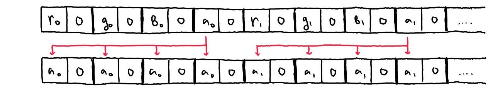

# Скриншоты


# Цель работы
Это продолжение работы (после Мандельброта) по оптимизации программ с использованием SIMD команд. В этой работе оптимизируется совмещение (блендинг) изображений с учетом их прозрачности с использованием линейной интерполяции.

# Введение
Один из вариантов для блендинга изображений с прозрачностью с использованием такой формулы:

`color = color_front * alpha + color_back * (1 - alpha)`, где `alpha` - альфа-составляющая заднего фона, выраженная в значении от 0 до 1.

Чтобы не проводить вычисления в нецелых числах и приводить их к целым, будем считать с переполнением в значениях от 0 до 255. 

## Метод оптимизации

Идея для оптимизации с помощью SIMD такова:
1. *Расширение чисел*

     
   Так как умножение однобайтных чисел может в результате дать двухбайтное, мы расширяем наши однобайтные компоненты цвета (R, G, B, A) до двухбайтных чисел. На картинке не показано, но из-за такого удвоения длины чисел, мы будем рассматривать исходные данные по половинкам, в нашем случае по 256 бит (32 бита * 8 пикселей). 
2. *Перенос альфа-компоненты*

    
    С помощью shuffle-устройства мы генерируем такую перестановку, чтобы поместить значение альфа-составляющей под остальными компонентами
3. *Перемножение*

    
4. *Упаковка чисел*

    
    Выделяем старшую часть числа, которая получилась при переполнении и выделяем её обратно в однобайтное число

На картинках показан общий принцип работы программы. Конкретная реализация приведена в коде, в ней используются команды для конвертации типов данных и битовых сдвигов.

# Методика измерений
Чтобы сравнить ускорение программы, я оцениваю количество кадров в секунду. Так как расчёт пикселя может занимать время меньшее по сравнению с выводом картинки на экран, был искусственно увеличен вес вычислений за счёт проведения фиксированное количество раз при каждой итерации цикла жизни программы. В моём случае расчёт был проведён 5000 раз.
Так мы можем пренебречь расходом времени на лишние этапы программы, которые мне не важны в работе и не соответствуют её цели и use-case.

# Ход работы
1. Была реализована базовая версия алгоритма
2. Код базовой версии был изменен с учётом дальнейшей идеи оптимизации. В дальнейшем эта версия обозначается *наивной*
4. Программа была оптимизирована с использование **AVX512**. Эта версия обозначается *оптимизированной*
5. Измерил производительность *оптимизированной* и *наивной* версии с учётом и без оптимизации компилятора
6. Воспользовался инструментом godbolt.org и рассмотрел ассемблерные инструкции, которые получаются на выходе компилятора
7. Сравнил набор команд, используемый компилятором в *наивной* и *оптимизированной* версиях
8. Сравнил оптимизацию интринсиков, используемых в *оптимизированной* версии
9. Проанализировал скорость работы и размер выходных инструкций

# Сравнение работы компилятора
## Сравнение *наивной* и *оптимизированной* версии
Приведу сравнение на фрагментe кода расчёта цвета:

```
    uint32_t alpha = (front_color >> 0x18) & 0xFF;

    uint32_t a = (uint16_t)  ((back_color >> 0x18) & 0xFF);

    uint32_t r = ((uint16_t) ( front_color          & 0xFF) * alpha +
                  (uint16_t) (  back_color          & 0xFF) * (255 - alpha)) >> 8;

    uint32_t g = ((uint16_t) ((front_color >> 0x8 ) & 0xFF) * alpha +
                  (uint16_t) (( back_color >> 0x8 ) & 0xFF) * (255 - alpha)) >> 8;

    uint32_t b = ((uint16_t) ((front_color >> 0x10) & 0xFF) * alpha +
                  (uint16_t) (( back_color >> 0x10) & 0xFF) * (255 - alpha)) >> 8;

    uint32_t color = (a << 0x18) +
                     (b << 0x10) +
                     (g <<  0x8) + r;
```

### Наивная версия с `-O2`:
```
    mov     r13d,   ecx
    mov     eax,    esi
    movzx   ebx,    ch
    movzx   r10d,   sil
    shr     r13d,   24
    movzx   ebp,    ah
    vmovq   rax,    xmm0
    sub     r12d,   r13d
    imul    ebx,    r13d
    imul    ebp,    r12d
    imul    r10d,   r12d
    add     ebx,    ebp
    movzx   ebp,    cl
    shr     ecx,    16
    imul    ebp,    r13d
    xor     bl,     bl
    movzx   ecx,    cl
    imul    ecx,    r13d
    add     ebp,    r10d
    shr     ebp,    8
    add     ebx,    ebp
    mov     ebp,    esi
    shr     esi,    16
    movzx   esi,    sil
    and     ebp,    -16777216
    imul    esi,    r12d
    add     ebx,    ebp
    add     ecx,    esi
    shr     ecx,    8
    sal     ecx,    16
    add     ebx,    ecx
```
Компилятор не может понять логику расчёта пикселей с расширением их компонент даже с указанием кода с битовыми сдвигами.

## Оптимизировнная версия с `-O2`:
```
    vmovdqu32       zmm4, ZMMWORD PTR [r8+rax]
    vmovdqu         ymm3, YMMWORD PTR [r8+rax]
    vmovdqu32       zmm1, ZMMWORD PTR [r9+rax]
    vmovdqu         ymm0, YMMWORD PTR [r9+rax]
    vextracti32x8   ymm2, zmm4, 0x1
    vpmovzxbw       zmm3, ymm3
    vpmovzxbw       zmm2, ymm2
    vpshufb         zmm5, zmm3, zmm7
    vextracti32x8   ymm1, zmm1, 0x1
    vpshufb         zmm4, zmm2, zmm7
    vpmullw         zmm3, zmm3, zmm5
    vpsubusw        zmm9, zmm6, zmm5
    vpsubusw        zmm8, zmm6, zmm4
    vpmovzxbw       zmm0, ymm0
    vpmovzxbw       zmm1, ymm1
    vpmullw         zmm0, zmm0, zmm9
    vpmullw         zmm1, zmm1, zmm8
    vpmullw         zmm2, zmm2, zmm4
    vpaddw          zmm0, zmm0, zmm3
    vpaddw          zmm1, zmm1, zmm2
    vpsrlw          zmm0, zmm0, 8
    vpsrlw          zmm1, zmm1, 8
    vpmovwb         ymm0, zmm0
    vpmovwb         ymm1, zmm1
    vinserti64x4    zmm0, zmm0, ymm1, 0x1
    vmovdqu64       ZMMWORD PTR [rsi+rax], zmm0
```
Компилятор использует **ZMM** регистры и рассчитывает всё по приведённой мною выше схеме.

## Оптимизация кода с интринсиками
Далее мы будем анализировать не наивный код, а код с использованием интринсиков. Приведу код для расчёта на одной из половин исходных данных.

```
    __m256i front_low_8pixels  = _mm512_extracti32x8_epi32(front, 0);
    
    __m512i  front_low_8pixels_expanded = _mm512_cvtepu8_epi16( front_low_8pixels);
    
    __m512i  move_alpha = _mm512_set_epi8(/*CONSTANTS. CHECK CODE*/);

    __m512i front_alpha_low_8pixels  = _mm512_shuffle_epi8( front_low_8pixels_expanded, move_alpha);
    
    __m512i max_alpha               = _mm512_set1_epi16(255);
    __m512i back_alpha_low_8pixels  = _mm512_subs_epu16(max_alpha, front_alpha_low_8pixels);
    
     front_low_8pixels_expanded = _mm512_mullo_epi16( front_low_8pixels_expanded, front_alpha_low_8pixels);
    
    __m256i back_low_8pixels  = _mm512_extracti32x8_epi32(back, 0);
    
    __m512i  back_low_8pixels_expanded = _mm512_cvtepu8_epi16( back_low_8pixels);
    
     back_low_8pixels_expanded = _mm512_mullo_epi16( back_low_8pixels_expanded,  back_alpha_low_8pixels);
    
    __m256i sum_low  = _mm512_cvtepi16_epi8(_mm512_srli_epi16(_mm512_add_epi16(front_low_8pixels_expanded,
                                                                                back_low_8pixels_expanded), 8));
```

Компилятор имеет возможность оптимизации интринсиков. Чтобы показать различие в количестве используемых AVX команд, привожу [ссылку на godbolt](https://godbolt.org/z/aWc8Yn5rW) для сравнения оптимизацию кода с интринсиками. По этой же ссылке приведён полный код вычислений с обеими половинами обрабатываемых данных. Слева приведён код на Си, справа приведено два блока соответственно снизу вверх с оптимизацией `-O0`, то есть совсем без оптимизации, и с `-O2`.


Компилятор выдаёт:
- **498 строк** кода без оптимизации интринсиков (`-O0`)
- **25 строк** ассемблерных команд с оптимизацией (`-O2`)

Видно, что компилятор смог преобразовать лишние расчёты, улучшить работу с регистрами и уменьшил размер кода примерно в 20 раз.

# Результаты замеров
Замеры производились при заряженном ноутбуке и работе от сети. Заряд устройства влияет на производительность, так как система может сама регулировать нагрузку и приоритет процессов в целях оптимизации расхода заряда.

| FPS                     | `-O0`  | `-O2`   |
|-------------------------|--------|---------|
| Наивная версия          | 186.92 | 434.35  |
| Оптимизированная версия | 307.20 | 2574.75 |
| Коэффициент ускорения   | 1.64   | 5.93    |

Коэффициент ускорения высчитывается как $k = \frac{k_1}{k_0}$, где $k_1$ - FPS *оптимизированной* версии, $k_0$ - *наивной* версии. Соответственно в каждом столбце формула рассматривается с ключами оптимизации `-O0` и `-O2`.

# Вывод
1. Компилятор (пока что) не умеет распространять однотипные действия алгоритма на большой массив данных, даже если явно показать ему идею рассчёта в виде битовых операций.
2. Используя **SIMD** команды, можно добиться ускорения программы примерно в 6 раз
3. Интринсики отличный способ для организации кода, который работает с использованием платформозависимых ассемблерных команд, так как они не мешают компилятору использовать средства оптимизации, в отличие от ассемблерных вставок

